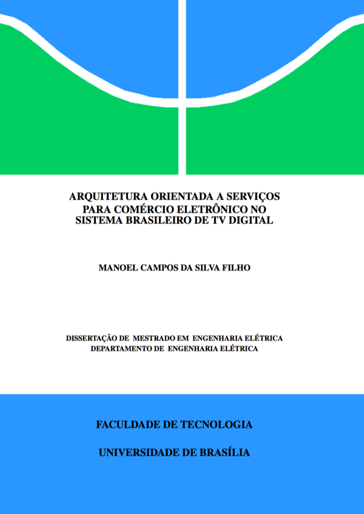

Dissertação de mestrado defendida na Universidade de Brasília em Junho de 2011. A mesma está publicada no [Repositório de Dissertações e Teses da Universidade de Brasília](http://repositorio.unb.br/handle/10482/10360).

O artigo sobre o projeto [NCLua SOAP](https://github.com/manoelcampos/NCLuaSOAP/) foi aprovado no Workshop de Computação Aplicada em Governo Eletrônico (WCGE) em 2011 no Brasil e está [disponível aqui](artigo-nclua-soap-wcge-2011/wcge-artigo-nclua-soap.pdf). Tal artigo é parte da dissertação e está incluído neste repositório. Informações sobre a aceitação do artigo podem ser conferidas na [página do evento](http://www4.serpro.gov.br/wcge2011/artigos-selecionados).

